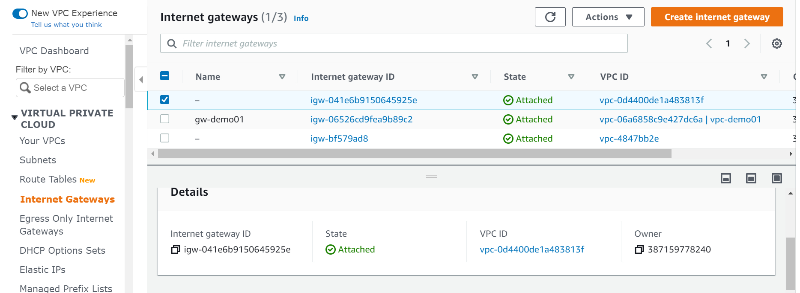

# SETUP REQUIRMENTS 

Tools needed for Environment setup:

1. Installed Virtualbox (=5.1.12 version)
2. Installed Vagrant (>=1.9.1 version)
3. Imported Centos 7 box (`vagrant box add centos/7`)

By default ansible is using `vagrant` username and `vagrant` password for ssh connection.

# ANSIBLE CONFIGURATION FILE 
ansible.cfg file include:
    - Dynamic Inventory on ./invetory foler, using ec2.py script to identify Instance info
    - remote user to login EC2 instance
    - Private Key use to login EC2 Instance

## ANSIBLE PLAYBOOK
1. LoadBalancer.yml: To Provisioning Infrastructure for Lab
    - tasks: 
        . Create Security Group webserver_sg
        . Create Security Group loadbalancer_sg
        . Create 2 EC2 instances for webserver
        . Create EC2 Instance for loadbalancer
    
2. PlaybookConfiguration.yml: Configuration for EC2 Instances
    - tasks:
        . Retrieve the IP Address of instances using the dynamic inventory concept.
        . Login Webserver EC2 using ssh and Configure: Commons installed, Nginx installed
        . Login Loadbalancer EC2 using ssh and Configure: Haproxy installed

-----------------------------------------------------------------------------------------
-----------------------------------------------------------------------------------------

# LAB STRUCTURE

# STEPs TO DEPLOY:

1. Pre-Configuration on AWS Management Console. This need to be manual prepared on AWS.
    
    a. Create a new VPC:

    

    b. Create a new Subnet under created VPC:

    

    c. Create an Internet Gateway and attach to created VPC

    

    d. Create a Route Table on created VPC, then add a default route target to new created Internet Gateway

    
    
    e. Create Key pair hat Ansible Mgmt box can use it to ssh to EC2 instances and update value to myrdr66.pem

    f. Create User and save the aws_access_key_id and aws_secret_access_key and update value to this file:
        secret/aws_credentials.yml

2. Start Ansible Mgmt box on local using command "Vagrant up"

3. After Ansible Mgmt box is up and running, ssh to this box using "Vagrant ssh"

4. Go to aws folder: cd provision/aws

5. Run ansible-playbook to create Lab Infrastructure: Security Group, EC2 Instances
    
    [vagrant@mgmt aws]$ ansible-playbook LoadBalancer.yml
    ...
    ...
    
TASK [Provisioning EC2 instances for webserver] **********************************************************************************************************************************************changed: [localhost]

TASK [Provisioning EC2 instances for LoadBalancer] *******************************************************************************************************************************************changed: [localhost]

PLAY RECAP ***********************************************************************************************************************************************************************************localhost                  : ok=5    changed=2    unreachable=0    failed=0    skipped=0    rescued=0    ignored=0   

6. Check on AWS EC2 Instance page to make sure 3 Instances are created: 2 webserver, 1 labbalancer.
    
    - Instance state: Running
    - Status Check: Passed

    

7. Run ansible-playbook to Configurate for EC2 Isntances:
    
    [vagrant@mgmt aws]$ ansible-playbook PlaybookConfiguration.yml 
    ...
    ...
    PLAY RECAP ***********************************************************************************************************************************************************************************3.106.138.21               : ok=5    changed=4    unreachable=0    failed=0    skipped=0    rescued=0    ignored=0
3.25.225.160               : ok=5    changed=4    unreachable=0    failed=0    skipped=0    rescued=0    ignored=0
3.26.34.3                  : ok=4    changed=3    unreachable=0    failed=0    skipped=0    rescued=0    ignored=0
localhost                  : ok=1    changed=0    unreachable=0    failed=0    skipped=0    rescued=0    ignored=0

8. Verify the configurarion is successful by open webrowser, and input public IP and port of Loadbalancer box.

    

